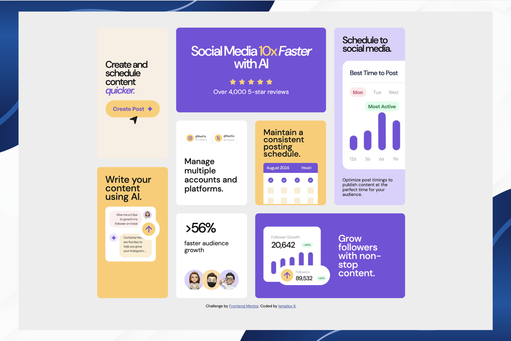

# Frontend Mentor - Bento Grid Solution

This is my solution to the [Bento grid challenge on Frontend Mentor](https://www.frontendmentor.io/challenges/bento-grid-RMydElrlOj).

## Table of contents

- [Overview](#overview)
  - [The challenge](#the-challenge)
  - [Screenshot](#screenshot)
  - [Links](#links)
- [My process](#my-process)
  - [Built with](#built-with)
  - [What I learned](#what-i-learned)
  - [Continued development](#continued-development)
- [Author](#author)

## Overview

### The challenge

Users should be able to:

- View the optimal layout for the interface depending on their device's screen size

### Screenshot

### Links

- Solution URL: [Solution](https://github.com/Ismail-SWE/bento-grid)
- Live Site URL: [Live Site](https://ismail-swe.github.io/bento-grid/)

## My process

### Built with

- Semantic HTML5 markup
- CSS custom properties
- Flexbox
- CSS Grid
- Mobile-first workflow

### What I learned

This project was a great exercise in working with CSS Grid beyond the basics. Before starting, I was comfortable with simple grid layouts, but this challenge pushed me to think more carefully about how grid areas and grid lines actually work together.

One thing that clicked for me was the difference between `grid-template-areas` and placing elements manually with `grid-column` / `grid-row`. I started with named areas because they felt more readable, but eventually switched to the line-based approach to get more precise control over how many rows each card spans. Using `grid-row: 1 / span 3` felt much more intentional than just naming zones.

I also got a better feel for when `overflow: hidden` on a card is actually doing useful work — hiding the parts of images that intentionally bleed out of the card edges. Pairing that with negative margins like `margin-bottom: -1.5rem` to push an image past the card boundary was a small trick that made a big visual difference.

Another thing I hadn't thought much about before was how `position: absolute` needs a `position: relative` parent to behave correctly. I ran into a bug where an image was escaping the card entirely and landing on top of other elements — the fix was simply adding `position: relative` to the card itself.

On the typography side, working directly from a Figma style guide helped me understand how design tokens translate into CSS. Matching `line-height: 0.935` or `letter-spacing: -3px` from a spec feels different from just eyeballing it, and I think my attention to those details improved a lot during this project.

### Continued development

I want to keep improving at:

- Building fully responsive layouts without relying on fixed pixel heights
- Getting more comfortable reading and implementing designs directly from Figma
- Writing cleaner, more organized CSS — especially avoiding conflicts between general rules like `.card img` and specific overrides

## Author

- Frontend Mentor - [@Ismail-SWE](https://www.frontendmentor.io/profile/Ismail-SWE)